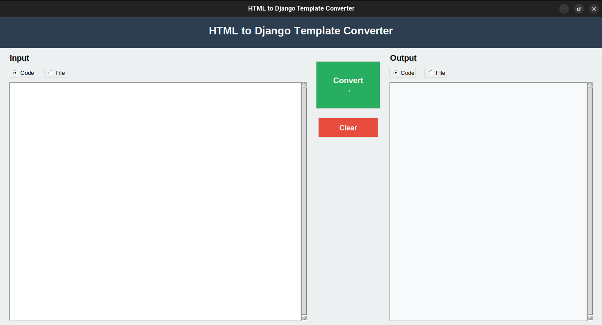

# Django Template Converter

A graphical tool for converting HTML files to standard Django templates

[](#فارسی)
[](#english)

---

## Support

<a href="https://www.coffeebede.com/hamesep">
  
</a>

<a href="https://nowpayments.io/donation?api_key=19623fa3-605a-436a-97cd-b5859356b41d" target="_blank">
  
</a>

---

## English

### Overview

Django Template Converter is a desktop application that automatically converts HTML files to Django-compatible templates. The tool features a graphical interface built with tkinter and handles conversion of static asset references to Django's template syntax.

### Interface Preview

<div align="center">
  
  <p><em>Main application interface showing input/output panels and conversion controls</em></p>
</div>

### Features

**Interface**
- Graphical user interface with dual-column layout
- Support for both code input and file selection
- Real-time conversion preview

**Conversion Capabilities**
- Automatic insertion of `` tag
- CSS stylesheet link conversion
- JavaScript source conversion
- Image source conversion
- Audio and video source conversion
- Srcset attribute conversion for responsive images

**Flexibility**
- Direct code input or file selection for input
- Display output in interface or save to file
- Simultaneous display and file saving

### Technology Stack

| Component | Technology |
|-----------|------------|
| Language | Python 3.6+ |
| HTML Parser | BeautifulSoup4 |
| XML Parser | lxml |
| GUI Framework | tkinter |
| Package Management | setuptools |

### Installation

1. Clone the repository
```bash
git clone <repository-url>
cd convert-to-django-template.py
```

2. Install dependencies
```bash
pip install -r requirements.txt
```

3. (Optional) Install as package
```bash
pip install -e .
```

### Usage

**Method 1: Direct Execution**
```bash
python main.py
```

**Method 2: Command Line (after package installation)**
```bash
django-template-converter
```

**Method 3: Python Module**
```python
from django_template_converter import Converter

converter = Converter()
output_path = converter.convert_file("input.html", "output.html")
```

### Conversion Examples

**CSS Links**
```html
<!-- Before -->
<link rel="stylesheet" href="css/style.css">

<!-- After -->
<link rel="stylesheet" href="">
```

**JavaScript**
```html
<!-- Before -->
<script src="js/main.js"></script>

<!-- After -->
<script src=""></script>
```

**Images**
```html
<!-- Before -->


<!-- After -->

```

**Responsive Images**
```html
<!-- Before -->


<!-- After -->

```

### Project Structure

```
convert-to-django-template.py/
├── django_template_converter/
│   ├── core/
│   │   └── converter.py
│   ├── gui/
│   │   └── window.py
│   └── utils/
│       └── helpers.py
├── tests/
│   └── test_converter.py
├── main.py
├── pyproject.toml
└── requirements.txt
```

### Configuration

The converter automatically handles:
- External URLs (http://, https://)
- Protocol-relative URLs (//)
- Data URIs (base64 images)
- Already converted templates

These patterns are excluded from conversion.

### Contributing

1. Fork the repository
2. Create a feature branch (`git checkout -b feature/NewFeature`)
3. Commit your changes (`git commit -m 'Add NewFeature'`)
4. Push to the branch (`git push origin feature/NewFeature`)
5. Open a Pull Request

### License

This project is licensed under the MIT License.

### Support

- Report issues: [GitHub Issues](https://github.com/your-repo/issues)
- Financial support: See support section above

---

## فارسی

### مروری بر پروژه

Django Template Converter یک برنامه دسکتاپ است که به صورت خودکار فایل‌های HTML را به تمپلیت‌های سازگار با Django تبدیل می‌کند. این ابزار دارای رابط گرافیکی ساخته شده با tkinter بوده و تبدیل منابع استاتیک به سینتکس تمپلیت Django را انجام می‌دهد.

### پیش‌نمایش رابط کاربری

<div align="center">
  
  <p><em>رابط اصلی برنامه شامل پنل‌های ورودی/خروجی و کنترل‌های تبدیل</em></p>
</div>

### ویژگی‌ها

**رابط کاربری**
- رابط گرافیکی با چیدمان دو ستونی
- پشتیبانی از ورودی کد و انتخاب فایل
- پیش‌نمایش تبدیل به صورت لحظه‌ای

**قابلیت‌های تبدیل**
- درج خودکار تگ ``
- تبدیل لینک‌های stylesheet
- تبدیل منابع JavaScript
- تبدیل منابع تصویر
- تبدیل منابع صوتی و تصویری
- تبدیل ویژگی srcset برای تصاویر واکنش‌گرا

**انعطاف‌پذیری**
- ورودی مستقیم کد یا انتخاب فایل
- نمایش خروجی در رابط یا ذخیره در فایل
- نمایش و ذخیره‌سازی همزمان

### پشته فناوری

| جزء | فناوری |
|-----|---------|
| زبان برنامه‌نویسی | Python 3.6+ |
| پردازشگر HTML | BeautifulSoup4 |
| پردازشگر XML | lxml |
| فریمورک رابط گرافیکی | tkinter |
| مدیریت پکیج | setuptools |

### نصب

1. کلون کردن مخزن
```bash
git clone <repository-url>
cd convert-to-django-template.py
```

2. نصب وابستگی‌ها
```bash
pip install -r requirements.txt
```

3. (اختیاری) نصب به عنوان پکیج
```bash
pip install -e .
```

### نحوه استفاده

**روش اول: اجرای مستقیم**
```bash
python main.py
```

**روش دوم: خط فرمان (پس از نصب پکیج)**
```bash
django-template-converter
```

**روش سوم: ماژول Python**
```python
from django_template_converter import Converter

converter = Converter()
output_path = converter.convert_file("input.html", "output.html")
```

### نمونه‌های تبدیل

**لینک‌های CSS**
```html
<!-- قبل -->
<link rel="stylesheet" href="css/style.css">

<!-- بعد -->
<link rel="stylesheet" href="">
```

**JavaScript**
```html
<!-- قبل -->
<script src="js/main.js"></script>

<!-- بعد -->
<script src=""></script>
```

**تصاویر**
```html
<!-- قبل -->


<!-- بعد -->

```

**تصاویر واکنش‌گرا**
```html
<!-- قبل -->


<!-- بعد -->

```

### ساختار پروژه

```
convert-to-django-template.py/
├── django_template_converter/
│   ├── core/
│   │   └── converter.py
│   ├── gui/
│   │   └── window.py
│   └── utils/
│       └── helpers.py
├── tests/
│   └── test_converter.py
├── main.py
├── pyproject.toml
└── requirements.txt
```

### پیکربندی

تبدیل‌کننده به صورت خودکار موارد زیر را مدیریت می‌کند:
- آدرس‌های خارجی (http://, https://)
- آدرس‌های مستقل از پروتکل (//)
- Data URI (تصاویر base64)
- تمپلیت‌های از قبل تبدیل شده

این الگوها از تبدیل استثنا می‌شوند.

### مشارکت

1. مخزن را Fork کنید
2. شاخه ویژگی جدید ایجاد کنید (`git checkout -b feature/NewFeature`)
3. تغییرات خود را Commit کنید (`git commit -m 'Add NewFeature'`)
4. به شاخه خود Push کنید (`git push origin feature/NewFeature`)
5. یک Pull Request باز کنید

### مجوز

این پروژه تحت مجوز MIT منتشر شده است.

### پشتیبانی

- گزارش مشکلات: [GitHub Issues](https://github.com/your-repo/issues)
- حمایت مالی: بخش حمایت بالای صفحه را ببینید

---

<div align="center">

*Version* 2.0.0 | *Python* 3.6+ | *Django* Compatible


---

© 2025 Django Template Converter

</div>
